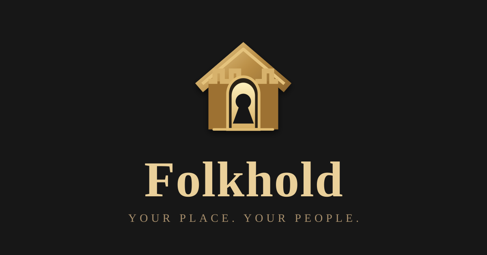

# Folkhold

  

**Your place. Your people.**

Folkhold is an experimental social web project built around personal spaces rather than flat profiles. Each member has a **Hold** containing rooms for the things they care about, and access to private Holds is granted through individually revocable **Keys** rather than shared passwords.

> **Advertising pays for Folkhold. Your private life does not.**

## Prototype

Folkhold now has a static GitHub Pages frontend plus a live Cloudflare Worker backend. The Public Square / Global Chat uses a Cloudflare Durable Object for realtime WebSocket conversation and persistent recent history.

Current prototype areas:

- **My Hold** — personal space and rooms
- **Public Square / Global Chat** — live global chronological conversation through Cloudflare
- **Notice Board** — Witcher-style persistent public notices
- **The Tavern** — adults-only, one-time warning, intentionally minimal moderation within a platform-wide legal/safety floor
- **Tea Room** — heavily moderated civility-first alternative
- **Directory** — broad or narrow people discovery
- **Key Ring** — individually issued and revocable access keys
- **Advertising** — one quiet banner per page, with Google AdSense wired as the first eligible provider and room-specific providers planned where needed
- **Accounts** — email/password, Google, and Apple account UI/backend staged with Better Auth; activation awaits the Cloudflare D1 binding and deployment secrets

## Core ideas

- A member owns a **Hold**, not merely a profile.
- A Hold may contain public rooms, keyed rooms, and private rooms.
- Every gifted Key is unique so one person's access can be revoked without changing everybody else's access.
- A listed Hold may still be locked. People without a Key can **Knock**.
- Members will be allowed substantial sandboxed HTML/CSS customization, inspired by the creative freedom of the early social web.
- Public discovery should be broad when the user wants it broad and precise when they want it precise.
- A future AI People Finder may help locate old friends using only information members explicitly make discoverable.
- Folkhold is intended to be a web application first. A separate native mobile application is not required for the core experience.

## Branding

The current approved mark is the **house-as-castle** concept: a protected personal Hold with a keyhole doorway. The compact mark lives at `assets/folkhold-mark.svg`; the full wordmark lockup is `assets/folkhold-logo.svg`. The site header, Home navigation, favicon metadata, web-app manifest, and social metadata now reference this identity.

## Accounts

Authentication is separated from Folkhold identity. Better Auth handles login/session state; Folkhold stores the member's username, display name, Hold ownership, rooms, keys, and social state separately.

The Cloudflare Worker also proxies the current GitHub Pages frontend so `folkhold.dereksparks1982.workers.dev` can become the same-origin account-capable application address without duplicating the UI. See `docs/ACCOUNTS.md` for the D1, secret, Google, and Apple activation steps.

## Advertising prototype

The ad slot is provider-neutral. Google AdSense is wired for ordinary pages but remains disabled until an approved publisher ID and responsive display-ad slot are supplied. See `docs/ADSENSE.md` for the activation path and the root-domain `ads.txt` note.

## Hosting

GitHub remains the source repository and project history. GitHub Pages hosts the public prototype frontend. Cloudflare Workers currently provides the realtime backend and is being expanded to accounts, persistence, secure Keys, uploads, and private access control.

## License

**Folkhold is proprietary source-available software, not open source.**

The repository may be viewed for personal, non-commercial evaluation, but the Folkhold code, design, documentation, and assets may not be commercially used, redistributed, republished, modified, rebranded, forked for deployment, or used to create derivative services without prior written permission from the copyright holder(s).

See [`LICENSE`](LICENSE) for the full terms. Third-party dependencies remain under their own licenses as documented in [`THIRD_PARTY.md`](THIRD_PARTY.md).

## Status

Active early prototype. Global Chat is live; account infrastructure is staged but not yet activated until its D1 database and secrets are connected.
